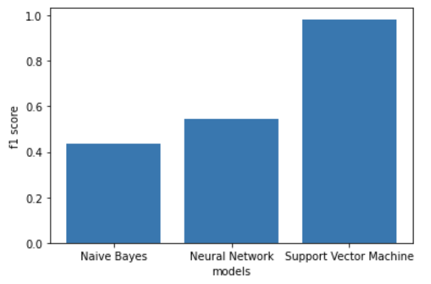
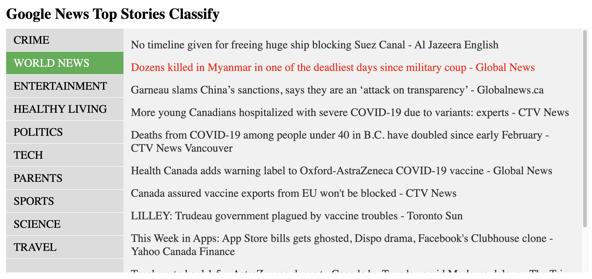

# News_categorize

News categorize use three machine learning models:
* Multinomial Naice Bayes
* Neuural Network
* Support Vector Machines

Dataset used from Kaggle: [News Category Dataset](https://www.kaggle.com/rmisra/news-category-dataset)

F1_score metrics used to evaluate the performance of models:

###### Package required:
* pandas
* sklearn

##### All the dataset process and models fit are implement in the jupyter notebook .ipynb

### Application:
Fetch the Top stories from the google news website. A web page to present the result of categorization.

#### How to execut
- open the .ipynb file to implement models, fetch the latest nes, create the result json file of categorization
- check if you have node.js. `node -v`
- Install node.js first. (https://nodejs.org/en/download/package-manager/#macos)
- Install http-server `npm install http-server -g`
- Go the web folder in the repository `cd web`
- `http-server -o -c-1`
- Go to http://127.0.0.1:8080/News.html

